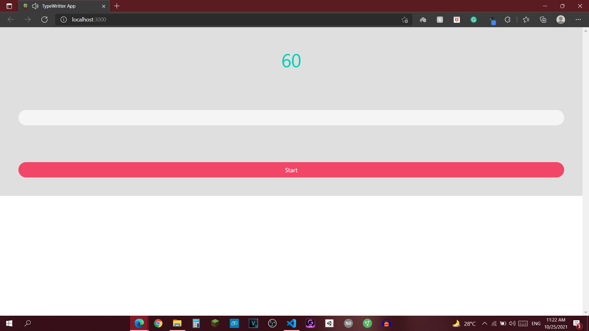
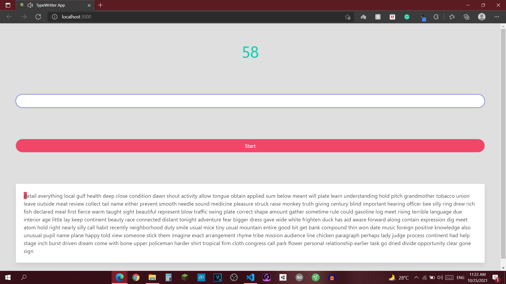
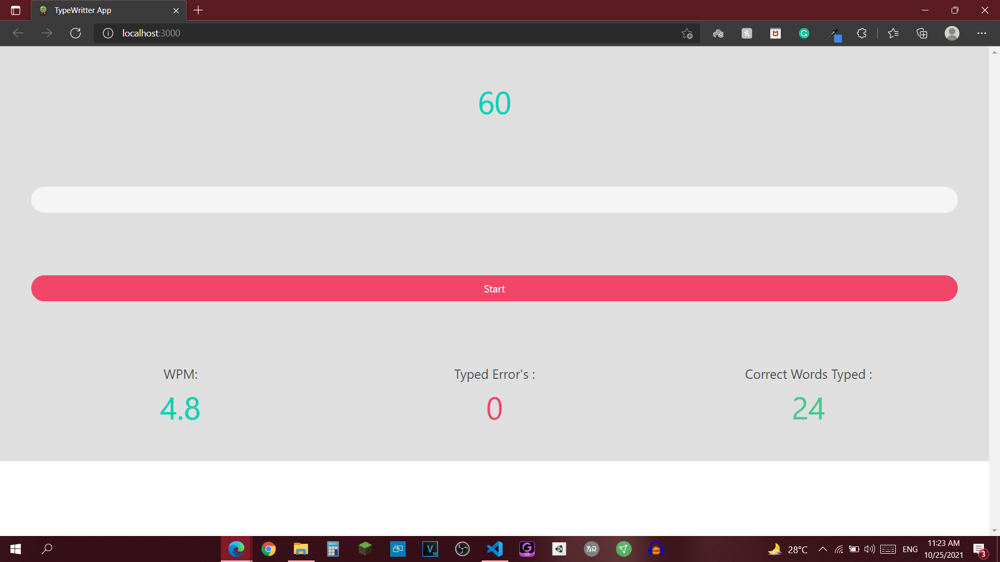
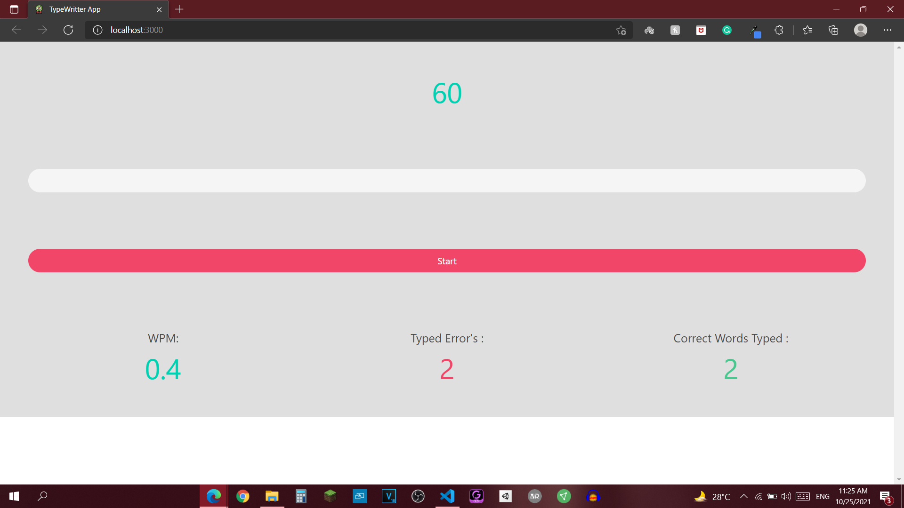

# Typewriter-App
This is a Typewriter App made using HTML, React, and Bulma CSS. This game has a 1-minute countdown. To start the game, first, you need to click on the start button then a random set of words will appear. Then you need to input correct words into the input field. After the countdown ends Results will appear and it will include WPM(words per minute), Total Errors, Correct Words. To start the game again press the start button.

Images are from Project
## 📸 ScreenShots

||
|------|

||
|------|

||
|------|

||
|------|

## 🤓 Author
* Email : nihalpadwal@gmail.com

## Getting Started
This Project uses ReactJS

React is a free and open-source front-end JavaScript library for building user interfaces or UI components. It is maintained by Facebook and a community of individual developers and companies. React can be used as a base in the development of single-page or mobile applications.
